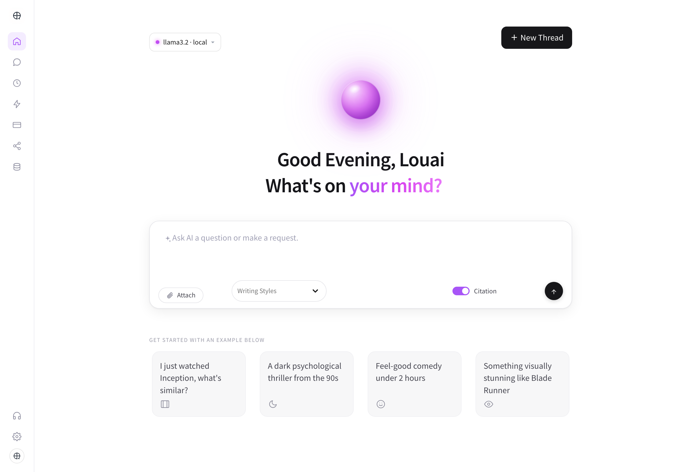

# LBH Cima — AI Movie Recommender & Local RAG Chatbot

> A fully private, local recommendation engine that pairs semantic search over a 4,800-film dataset with a locally-hosted LLM. No API keys, no cloud calls, no usage costs.



## Project Overview

LBH Cima is an interactive movie recommendation platform that runs entirely on local infrastructure. It combines content-based semantic search with a Retrieval-Augmented Generation (RAG) pipeline driven by a local Ollama server, so users can converse naturally with the assistant to discover films — without any request ever leaving the machine.

The core design constraint is **grounding**: the model is never allowed to recommend from memory. Every response is constrained to films retrieved from the local dataset, which keeps recommendations real and verifiable rather than hallucinated.

## Key Features

* **100% local inference** — No API keys, no rate limits, complete data privacy. Ollama runs Llama 3.2 on your own machine.
* **Grounded RAG pipeline** — The system prompt restricts the model to a candidate list built from live retrieval, so it cannot invent titles that aren't in the dataset.
* **Semantic retrieval** — Queries are embedded with `all-MiniLM-L6-v2` and matched against precomputed film embeddings via cosine similarity over a normalized vector space.
* **Citations panel** — Toggle *Citation* to see exactly which films were retrieved for a query, with their similarity scores. This surfaces the retrieval step that normally stays hidden inside a RAG app.
* **Writing styles** — Switch between Default, Concise, Detailed and Playful response registers.
* **Streaming responses** — Tokens render as they arrive from Ollama, with a live typewriter cursor.
* **Custom light UI** — A minimalist ChatGPT/Claude-style interface built entirely in CSS on top of Streamlit: animated gradient orb, time-aware greeting, prompt cards, and a fixed icon rail.

## Tech Stack

| Layer | Choice |
|---|---|
| Language | Python 3.12 |
| Frontend | Streamlit 1.40 |
| Architecture | Retrieval-Augmented Generation (RAG) |
| Local LLM | Ollama (`llama3.2`) |
| Embeddings | `sentence-transformers` (`all-MiniLM-L6-v2`, 384-dim) |
| Data | Pandas, NumPy, scikit-learn |

## How It Works

```
User query
    │
    ▼
┌─────────────────────────────┐
│ 1. Embed the query          │  all-MiniLM-L6-v2 → 384-dim normalized vector
└─────────────────────────────┘
    │
    ▼
┌─────────────────────────────┐
│ 2. Retrieve top-10          │  embeddings @ query_vec  (cosine similarity,
│    nearest films            │  since both sides are L2-normalized)
└─────────────────────────────┘
    │
    ▼
┌─────────────────────────────┐
│ 3. Build grounded prompt    │  Candidates injected with title, year, genres,
│                             │  director, rating and plot summary
└─────────────────────────────┘
    │
    ▼
┌─────────────────────────────┐
│ 4. Generate (streamed)      │  Local llama3.2 picks 3–5 films from the
│                             │  candidate list and justifies each one
└─────────────────────────────┘
```

Because the embeddings are precomputed and stored in `data/embeddings.npy`, retrieval is a single matrix multiplication — there is no vector database and no index build step at startup.

## Repository Structure

```text
movie-recommender-ai/
├── .streamlit/
│   └── config.toml        # Pins the light theme (see "Theming" below)
├── assets/                # Logo and static images
├── data/
│   ├── movies_clean.pkl   # Cleaned film metadata
│   └── embeddings.npy     # Precomputed 384-dim film embeddings
├── notebooks/             # Data exploration and embedding generation
├── src/
│   ├── data_loader.py     # Dataset ingestion and cleaning
│   ├── embedder.py        # Embedding generation utilities
│   └── recommender.py     # RAG pipeline: retrieval + Ollama generation
├── app.py                 # Streamlit UI and chat orchestration
├── requirements.txt
└── runtime.txt
```

## How to Run Locally

No API keys required.

**1. Install Ollama and pull the model**

Download [Ollama](https://ollama.com/), then pull the model:

```bash
ollama pull llama3.2
```

Make sure the Ollama application is running in the background before starting the app.

**2. Clone the repository**

```bash
git clone https://github.com/Louai-Ulaval/movie-recommender-ai.git
```

**3. Install dependencies**

```bash
pip install -r requirements.txt
```

**4. Launch**

```bash
streamlit run app.py
```

The app opens automatically at http://localhost:8501. First launch downloads the `all-MiniLM-L6-v2` model (~90 MB) and caches it locally; subsequent launches are instant.

## Theming

The UI is pinned to light mode in `.streamlit/config.toml`. This is deliberate and load-bearing rather than cosmetic.

When no theme is pinned, Streamlit follows the operating system's colour scheme. On a machine in dark mode it bakes dark values directly into its own generated CSS, which meant the fixed bottom container behind the chat input rendered as a black strip under an otherwise white page. Overriding `.stApp` alone never reached it, because the background is painted by an unnamed wrapper `div` nested inside `[data-testid="stBottom"]`.

Pinning `base = "light"` stops those dark values from being generated at all; the CSS in `app.py` then repaints the full bottom subtree as a second line of defence. Changing the theme requires a **full restart** — `config.toml` is read once at boot and is not picked up by hot reload.

## Engineering Contributions

* **System architecture** — Designed the retrieval-to-generation pipeline connecting the static embedding store to real-time local inference.
* **Grounded generation** — Authored the system prompt and candidate-injection format that constrain the model to real dataset entries, eliminating hallucinated recommendations.
* **Local AI infrastructure** — Integrated Ollama and `sentence-transformers` to remove all cloud dependencies, producing a fully private, offline, zero-cost inference environment.
* **State management** — Built the stateful conversation layer so multi-turn context is carried into the RAG window while retrieval stays scoped to the current query.
* **Interface engineering** — Implemented the full custom design system in CSS over Streamlit's DOM, including the animated gradient orb, prompt cards, and citation surfacing.

---

*Developed for the Louai Ben Hassine portfolio.*
